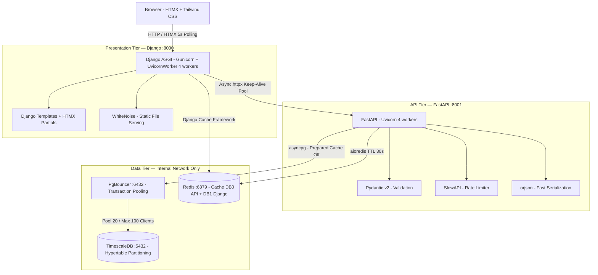
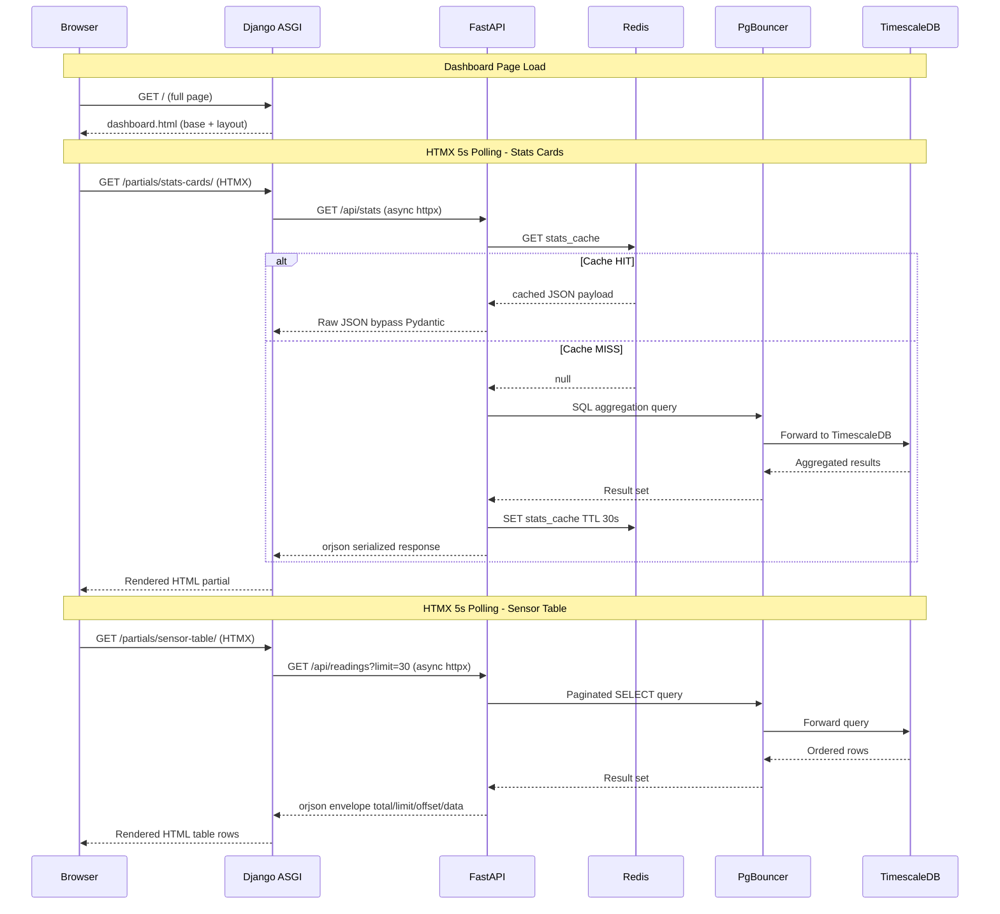
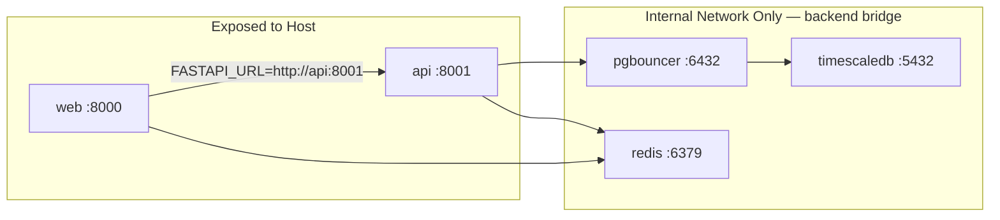
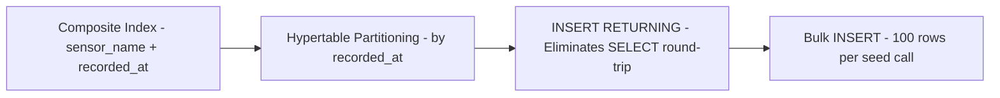
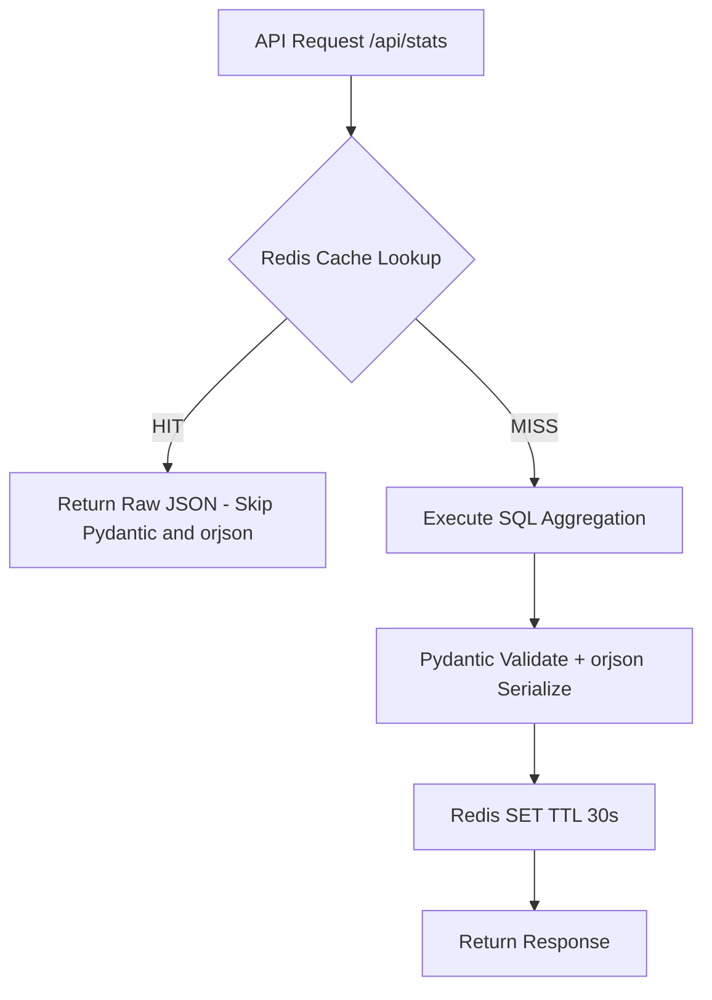
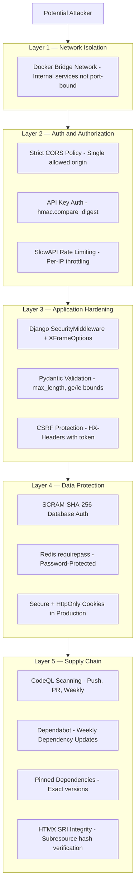
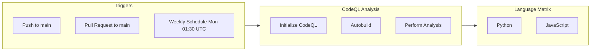
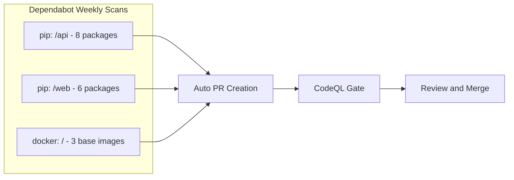

# 📡 Sensor Dashboard


A **production-grade**, full-stack demo application showcasing a modern web architecture for real-time sensor data monitoring. Built with **Django** (UI), **FastAPI** (async API engine), **HTMX**, **Tailwind CSS**, **TimescaleDB**, **PgBouncer**, and **Redis** — all orchestrated with **Docker Compose**.

---

## 📑 Table of Contents

- [System Architecture](#️-system-architecture)
- [Technology Stack](#-technology-stack)
- [Project Structure](#-project-structure)
- [Quick Start](#-quick-start)
- [Environment Variables](#-environment-variables-reference)
- [API Reference](#-api-reference)
- [Performance Optimizations](#-performance-optimizations)
- [Security Measures](#️-security-measures)
- [CI/CD & DevOps](#-cicd--devops)
- [Contributing](#-contributing)
- [Operational Guide](#-operational-guide)
- [License](#-license)

---

## 🏗️ System Architecture

### High-Level Overview

The system follows a **microservices-inspired** two-tier architecture separating the presentation layer (Django) from the data/API layer (FastAPI), connected through an internal Docker bridge network.



### Request Lifecycle



### Docker Network Topology



> **⚠️ Note:** TimescaleDB, PgBouncer, and Redis are **strictly network-isolated** — they are never bound to host ports and are only reachable within the Docker `backend` bridge network.

---

## 🧰 Technology Stack

### Backend Services

| Technology | Version | Role | Why This Choice |
|:-----------|:--------|:-----|:----------------|
| **Django** | 5.1 | Web UI framework (ASGI) | Mature templating, middleware pipeline, security defaults |
| **FastAPI** | 0.115.0 | Async REST API engine | Native `async/await`, auto OpenAPI docs, Pydantic integration |
| **Gunicorn** | 23.0.0 | WSGI/ASGI process manager | Production-grade worker management with `UvicornWorker` |
| **Uvicorn** | 0.30.0 | ASGI server | High-performance async event loop for both Django and FastAPI |
| **SQLAlchemy** | 2.0.35 | Async ORM (API layer) | Full async support via `asyncpg`, `insert().returning()` optimization |
| **asyncpg** | 0.30.0 | PostgreSQL async driver | Fastest Python PostgreSQL driver, native prepared statements |
| **Pydantic** | 2.9.0 | Data validation and serialization | Type-safe schemas with `model_validate()` and `from_attributes` |
| **httpx** | 0.27.0 | Async HTTP client (Django → FastAPI) | Persistent connection pooling with keep-alive support |

### Data Layer

| Technology | Version | Role | Why This Choice |
|:-----------|:--------|:-----|:----------------|
| **TimescaleDB** | 2.25.2 (PG 16) | Time-series database | Hypertable auto-partitioning, optimized for time-ordered writes |
| **PgBouncer** | 1.25.1 | Connection pooler | Transaction-mode pooling reduces connection overhead by ~10x |
| **Redis** | 7.4 Alpine | In-memory cache | Sub-millisecond cache reads, dual-database isolation (API: db0, Django: db1) |

### Frontend and UI

| Technology | Version | Role | Why This Choice |
|:-----------|:--------|:-----|:----------------|
| **HTMX** | 2.0.2 | Dynamic UI without JS frameworks | Server-rendered partials, 5s polling, zero build step |
| **Tailwind CSS** | CDN | Utility-first styling | Dark mode support, responsive design, Inter font family |
| **Inter** | Google Fonts | Typography | Clean, modern interface typography (weights: 300–700) |

### DevOps and Infrastructure

| Technology | Role | Details |
|:-----------|:-----|:--------|
| **Docker Compose** | Orchestration | 5 services, health-checked, restart policies, volume persistence |
| **WhiteNoise** | Static files | `CompressedManifestStaticFilesStorage` — Brotli/gzip with cache busting |
| **GitHub Actions** | CI/CD | CodeQL security scans (Python + JS) on push, PR, and weekly schedule |
| **Dependabot** | Dependency updates | Weekly scans for `pip` (api + web) and `docker` ecosystems |

---

## 📁 Project Structure

```
sensor-dashboard/
├── .env.example              # Template for required environment variables
├── .github/
│   ├── ISSUE_TEMPLATE/
│   │   ├── bug_report.md     # Structured bug report template
│   │   └── feature_request.md
│   ├── PULL_REQUEST_TEMPLATE.md
│   ├── dependabot.yml        # Weekly pip + docker dependency scans
│   └── workflows/
│       └── codeql.yml        # Automated CodeQL security analysis
├── SECURITY.md               # Vulnerability reporting policy
├── docker-compose.yml        # 5-service orchestration manifest
│
├── api/                      # FastAPI — Async REST Engine
│   ├── Dockerfile            # Python 3.12-slim, non-root appuser
│   ├── requirements.txt      # 8 pinned dependencies
│   └── app/
│       ├── main.py           # Routes, middleware, lifespan, rate limiting
│       ├── database.py       # SQLAlchemy async engine + session factory
│       ├── models.py         # SensorReading ORM model + composite index
│       ├── schemas.py        # Pydantic v2 request/response schemas
│       └── seed.py           # Bulk demo data generator (100 rows/call)
│
└── web/                      # Django — Presentation Layer
    ├── Dockerfile            # Python 3.12-slim, collectstatic, non-root
    ├── requirements.txt      # 6 pinned dependencies
    └── dashboard/
        ├── manage.py
        ├── config/
        │   ├── settings.py   # Security headers, caching, structured logging
        │   ├── urls.py
        │   ├── asgi.py       # ASGI entrypoint for Gunicorn + Uvicorn
        │   └── wsgi.py
        └── sensors/
            ├── views.py      # Async views with httpx connection pooling
            ├── urls.py       # 5 URL patterns (dashboard + partials + actions)
            └── templates/sensors/
                ├── base.html              # Layout: navbar, theme toggle, HTMX config
                ├── dashboard.html         # Main dashboard composition
                └── partials/
                    ├── stats_cards.html   # HTMX partial: aggregated stats
                    └── sensor_table.html  # HTMX partial: readings table
```

---

## 🚀 Quick Start

### Prerequisites

| Tool | Minimum Version | Purpose |
|:-----|:----------------|:--------|
| **Docker** | 20.10+ | Container runtime |
| **Docker Compose** | 2.0+ | Service orchestration |
| **Git** | 2.0+ | Repository cloning |
| **cURL** | Any | Demo data seeding (optional) |

### Installation and Setup

**1. Clone the Repository**

```bash
git clone <repo-url>
cd sensor-dashboard
```

**2. Configure Environment Variables**

```bash
cp .env.example .env
```

> **⚠️ Critical:** Edit `.env` and replace **all** placeholder values with cryptographically strong secrets:
> - `POSTGRES_PASSWORD` — strong database password (20+ chars)
> - `REDIS_PASSWORD` — strong Redis auth password
> - `SECRET_KEY` — random 50+ character string for Django CSRF/session signing
> - `API_KEY` — random token for protecting mutating API endpoints

**3. Build and Start Services**

```bash
docker compose up --build -d
```

All services have health checks. Wait until `docker compose ps` shows all containers as `healthy` before proceeding.

**4. Seed Demo Data** *(Optional)*

```bash
# Replace <your-api-key> with the API_KEY value from your .env file
curl -H "X-API-Key: <your-api-key>" -X POST http://localhost:8001/api/seed
```

This inserts 100 randomized sensor readings (temperature, humidity, pressure) spread over the last 24 hours. You can call it multiple times — data is **appended**, not replaced.

**5. Access the Application**

Open your browser and navigate to: **[http://localhost:8000](http://localhost:8000)**

The dashboard auto-refreshes every 5 seconds via HTMX polling and supports light/dark/system theme modes.

---

## 🔑 Environment Variables Reference

| Variable | Description | Required | Default | Example |
|:---------|:------------|:--------:|:--------|:--------|
| `POSTGRES_USER` | Database username | ✅ | — | `admin` |
| `POSTGRES_PASSWORD` | Strong database password | ✅ | — | *(use a secure random value)* |
| `POSTGRES_DB` | Logical database name | ✅ | — | `sensors_db` |
| `REDIS_PASSWORD` | Redis authentication password | ✅ | — | *(use a secure random value)* |
| `SECRET_KEY` | Django cryptographic key (CSRF, sessions) | ✅ | — | *(50+ random chars)* |
| `API_KEY` | Secret key for protected API endpoints | ✅ | — | *(use a secure random value)* |
| `DEBUG` | Django debug mode (`0` = production, `1` = debug) | ❌ | `0` | `0` |
| `ALLOWED_HOSTS` | Comma-separated valid host headers | ❌ | `localhost` | `localhost,127.0.0.1` |

> **💡 Tip:** Generate secure values with: `python -c "import secrets; print(secrets.token_urlsafe(48))"`

---

## 🔌 API Reference

The FastAPI backend (`http://localhost:8001`) exposes a RESTful interface. OpenAPI documentation is auto-generated at `/docs`.

| Method | Endpoint | Auth | Rate Limit | Description |
|:-------|:---------|:----:|:----------:|:------------|
| `GET` | `/api/health` | — | — | Returns `{"status": "ok"}` health probe |
| `POST` | `/api/readings` | 🔑 `X-API-Key` | 60/min | Ingest a single sensor reading |
| `GET` | `/api/readings` | — | 120/min | Paginated readings (`?sensor=&limit=&offset=`) |
| `GET` | `/api/stats` | — | 120/min | Aggregated statistics per sensor *(cached 30s)* |
| `POST` | `/api/seed` | 🔑 `X-API-Key` | 10/min | Generate 100 random demo readings |
| `DELETE` | `/api/readings` | 🔑 `X-API-Key` | 10/min | Truncate all readings and clear cache |

### Request/Response Examples

<details>
<summary><b>POST /api/readings</b> — Ingest a reading</summary>

```bash
curl -X POST http://localhost:8001/api/readings \
  -H "Content-Type: application/json" \
  -H "X-API-Key: <your-api-key>" \
  -d '{"sensor_name": "temperature", "value": 23.5}'
```

**Response** `201 Created`:
```json
{
  "id": 1,
  "sensor_name": "temperature",
  "value": 23.5,
  "recorded_at": "2026-03-05T05:30:00+00:00"
}
```

</details>

<details>
<summary><b>GET /api/readings</b> — Fetch paginated readings</summary>

```bash
curl "http://localhost:8001/api/readings?sensor=temperature&limit=10&offset=0"
```

**Response** `200 OK`:
```json
{
  "total": 42,
  "limit": 10,
  "offset": 0,
  "data": [
    {
      "id": 42,
      "sensor_name": "temperature",
      "value": 27.3,
      "recorded_at": "2026-03-05T05:30:00+00:00"
    }
  ]
}
```

</details>

<details>
<summary><b>GET /api/stats</b> — Aggregated statistics</summary>

```bash
curl http://localhost:8001/api/stats
```

**Response** `200 OK` *(cached for 30 seconds)*:
```json
[
  {
    "sensor_name": "humidity",
    "count": 35,
    "avg": 58.42,
    "min": 31.07,
    "max": 88.94
  },
  {
    "sensor_name": "temperature",
    "count": 33,
    "avg": 24.18,
    "min": 15.22,
    "max": 34.87
  }
]
```

</details>

---

## ⚡ Performance Optimizations

This project implements multiple layers of performance optimization across the entire stack.

### Database and Query Optimization



| Optimization | Layer | Impact | Implementation |
|:-------------|:------|:-------|:---------------|
| **Hypertable Partitioning** | TimescaleDB | Partition pruning on time-range queries | `create_hypertable('sensor_readings', 'recorded_at')` |
| **Composite B-tree Index** | PostgreSQL | Fast sensor+time-range lookups without redundant indexes | `ix_sensor_name_recorded_at` on `(sensor_name, recorded_at)` |
| **`INSERT RETURNING`** | SQLAlchemy | Saves one SELECT round-trip per insert | `SensorReading.__table__.insert().returning()` |
| **Bulk Insert** | SQLAlchemy | Single INSERT statement for 100 rows | `session.execute(insert(SensorReading), rows)` inside explicit transaction |
| **Advisory Locks** | PostgreSQL | Prevents DDL race conditions across 4 concurrent Uvicorn workers on startup | `pg_advisory_xact_lock(1337)` |

### Connection Pooling

| Optimization | Layer | Configuration | Impact |
|:-------------|:------|:--------------|:-------|
| **PgBouncer Transaction Pooling** | Connection layer | `POOL_MODE=transaction`, `DEFAULT_POOL_SIZE=20`, `MAX_CLIENT_CONN=100` | ~10x connection reuse; each FastAPI worker shares a pool of 20 real DB connections |
| **SQLAlchemy Async Pool** | Application layer | `pool_size=5`, `max_overflow=10`, `pool_pre_ping=True` | Pre-ping detects stale connections; overflow handles burst traffic |
| **Prepared Statement Cache Disabled** | asyncpg | `prepared_statement_cache_size=0` | Required for PgBouncer compatibility in transaction pooling mode |
| **SCRAM-SHA-256 Auth** | PgBouncer | `AUTH_TYPE=scram-sha-256` | Modern password hashing for pooler-to-database authentication |

### Caching Strategy



| Optimization | Layer | Configuration | Impact |
|:-------------|:------|:--------------|:-------|
| **Redis Stats Cache** | API (DB 0) | 30s TTL on `stats_cache` key | Eliminates expensive `GROUP BY` aggregation queries |
| **Django Cache Framework** | Web (DB 1) | `RedisCache` backend on separate DB | Framework-level caching independent of API cache |
| **Cache-Through Response** | FastAPI | Raw cached bytes → `Response(content=cached)` | On cache hit: zero Pydantic validation, zero serialization overhead |
| **Single Serialization** | FastAPI | `orjson.dumps()` once → store and return | Avoids double serialization (orjson → Redis → orjson) |
| **Dual Redis Databases** | Redis | API on `db0`, Django on `db1` | Namespace isolation prevents key collisions between services |

### HTTP and Network Optimization

| Optimization | Layer | Configuration | Impact |
|:-------------|:------|:--------------|:-------|
| **Persistent `httpx.AsyncClient`** | Django → FastAPI | Module-level client, `max_keepalive=50`, `max_connections=200` | TCP connection reuse across all Django requests (no per-request handshake) |
| **`orjson` Serialization** | FastAPI responses | `Response(content=orjson.dumps(...))` | 2–10x faster JSON serialization vs stdlib `json` |
| **WhiteNoise Static Files** | Django | `CompressedManifestStaticFilesStorage` | Brotli/gzip compression + content-hashed filenames for infinite caching |
| **Non-blocking Font Loading** | Frontend | `rel="preload"` with `onload` swap | Eliminates render-blocking on Google Fonts |
| **HTMX Partial Rendering** | Frontend | Server-rendered HTML fragments, 5s polling | Only changed DOM sections are transferred — no full-page reloads |

### Worker and Process Architecture

| Service | Server | Workers | Timeout | Command |
|:--------|:-------|:-------:|:-------:|:--------|
| **Django (web)** | Gunicorn + UvicornWorker | 4 | 30s | `gunicorn config.asgi:application --worker-class uvicorn.workers.UvicornWorker` |
| **FastAPI (api)** | Uvicorn | 4 | — | `uvicorn app.main:app --workers 4` |

> Both services run as ASGI applications, fully supporting Python `async/await` for non-blocking I/O across all database, cache, and HTTP operations.

---

## 🛡️ Security Measures

This project implements **defense-in-depth** across multiple layers.

### Security Architecture Overview



### Network and Infrastructure Security

| Measure | Implementation | Details |
|:--------|:---------------|:--------|
| **Network Isolation** | Docker Compose `networks` | TimescaleDB, PgBouncer, Redis have **zero host port bindings** — accessible only via `backend` bridge |
| **Non-root Containers** | `Dockerfile` `USER appuser` | Both `api` and `web` services drop to an unprivileged `appuser` created with `useradd -r -s /usr/sbin/nologin` |
| **Restart Policies** | `restart: unless-stopped` | All services auto-recover from crashes without exposing failure states |
| **Health Checks** | Docker health probes | Every service has a health check (`pg_isready`, `pidof`, `redis-cli ping`, HTTP probes) with retry logic |
| **Slim Base Images** | `python:3.12-slim` | Minimal attack surface — no unnecessary system packages |
| **No Cache Pip** | `--no-cache-dir` | No pip cache stored in final image — smaller image, no cache artifacts |

### Authentication and Access Control

| Measure | Implementation | Details |
|:--------|:---------------|:--------|
| **API Key Authentication** | `X-API-Key` header dependency | Protects `POST /api/readings`, `POST /api/seed`, `DELETE /api/readings` |
| **Constant-Time Comparison** | `hmac.compare_digest()` | Prevents timing-based side-channel attacks on API key verification |
| **Strict CORS Policy** | `CORSMiddleware` | Only `CORS_ORIGIN` (Django frontend) is allowed — all other origins rejected |
| **CORS Method Restriction** | Explicit allow list | Only `GET`, `POST`, `DELETE` methods; only `Content-Type` and `X-API-Key` headers |
| **Rate Limiting** | SlowAPI per-IP | `60/min` writes, `120/min` reads, `10/min` admin operations — prevents abuse and DoS |

### Application Security

| Measure | Implementation | Details |
|:--------|:---------------|:--------|
| **Content-Type Nosniff** | `SECURE_CONTENT_TYPE_NOSNIFF = True` | Prevents MIME-type sniffing attacks |
| **Clickjacking Protection** | `X_FRAME_OPTIONS = "DENY"` | Page cannot be embedded in frames or iframes |
| **XSS Filter** | `SECURE_BROWSER_XSS_FILTER = True` | Enables browser-level XSS protection |
| **CSRF Protection** | Django middleware + HTMX headers | `hx-headers='{"X-CSRFToken": "{{ csrf_token }}"}'` sent with every HTMX request |
| **Secure Cookies (Production)** | Conditional on `DEBUG=False` | `SESSION_COOKIE_SECURE`, `CSRF_COOKIE_SECURE`, `CSRF_COOKIE_HTTPONLY`, `SameSite=Strict` |
| **Input Validation** | Pydantic field constraints | `sensor_name: max_length=100`, `value: ge=-1e6, le=1e6` — prevents oversized/extreme inputs |
| **Structured Logging** | Django `LOGGING` config | Verbose format with `levelname`, `asctime`, `module`, `process`, `thread` — separate logger for `sensors` app and `django.request` |

### Data Protection

| Measure | Implementation | Details |
|:--------|:---------------|:--------|
| **Database Authentication** | `SCRAM-SHA-256` | PgBouncer authenticates to TimescaleDB using modern SCRAM-SHA-256 (not md5) |
| **Redis Authentication** | `--requirepass` | Redis requires password for all operations; used in both API and Django connections |
| **Persistent Volumes** | Docker named volumes | `timescaledb_data` and `redis_data` survive container restarts |
| **Environment Secrets** | `.env` file (gitignored) | Secrets never hardcoded — loaded via `${VAR}` in Compose and `os.environ` in code |

### Supply Chain and CI/CD Security

| Measure | Implementation | Details |
|:--------|:---------------|:--------|
| **CodeQL Analysis** | GitHub Actions workflow | Scans Python + JavaScript on every push, PR to `main`, and weekly (`cron: 30 1 * * 1`) |
| **Dependabot** | `.github/dependabot.yml` | Weekly updates for `pip` (api + web dirs) and `docker` ecosystem |
| **Pinned Dependencies** | Exact versions in `requirements.txt` | e.g. `fastapi==0.115.0`, `django==5.1` — no floating versions |
| **SRI Hash Verification** | HTMX `<script>` tag | `integrity="sha384-..."` ensures CDN-delivered HTMX has not been tampered with |
| **Security Policy** | `SECURITY.md` | Responsible disclosure process with 48-hour response SLA |

---

## 🔄 CI/CD and DevOps

### GitHub Actions Pipeline



### Dependency Management



### Issue and PR Templates

The project includes structured GitHub templates for consistent collaboration:

- **🐛 Bug Report Template** — Steps to reproduce, expected vs actual behavior
- **✨ Feature Request Template** — Use case, proposed solution, alternatives
- **📋 Pull Request Template** — Change description, testing, checklist

---

## 🤝 Contributing

We welcome contributions from the community! Please follow these guidelines:

1. **Fork** the repository and create your feature branch from `main`
2. **Use the templates** — File bugs via the issue template and PRs via the PR template (`.github/`)
3. **Test locally** — Run `docker compose up --build` to verify your changes end-to-end
4. **Pin dependencies** — Use exact versions in `requirements.txt` files
5. **Follow existing patterns** — Async views, Pydantic schemas, structured error handling

---

## 🛑 Operational Guide

### Service Management

```bash
# Start all services (detached)
docker compose up --build -d

# View real-time logs from all services
docker compose logs -f

# View logs for a specific service
docker compose logs -f api

# Check service health status
docker compose ps

# Restart a single service
docker compose restart web
```

### Stopping Services

```bash
# Graceful shutdown (preserves data volumes)
docker compose down

# Full teardown including data volumes
# WARNING: Destroys all TimescaleDB and Redis data
docker compose down -v
```

### Data Management

```bash
# Seed 100 demo readings (appends to existing data)
curl -H "X-API-Key: <your-api-key>" -X POST http://localhost:8001/api/seed

# Clear all readings and reset cache
curl -H "X-API-Key: <your-api-key>" -X DELETE http://localhost:8001/api/readings

# Health check
curl http://localhost:8001/api/health
```

---

## 📄 License

This software is licensed under the [MIT License](LICENSE).
