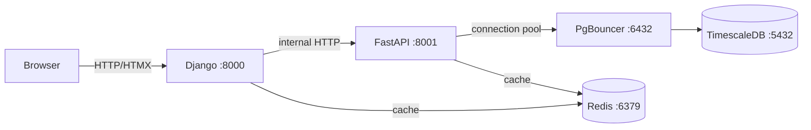

# Sensor Dashboard


A full-stack demo application showcasing a modern web architecture with **Django** (UI), **FastAPI** (API engine), **HTMX**, **Tailwind CSS**, **TimescaleDB**, **PgBouncer**, and **Redis**. The entire stack is effortlessly orchestrated using **Docker Compose**.

## 🏗️ Architecture



| Service | Role | Internal | Exposed |
|---------|------|----------|---------|
| **Django** | Web UI (HTMX + Tailwind CSS) | 8000 | `:8000` |
| **FastAPI** | REST API engine | 8001 | `:8001` |
| **TimescaleDB** | Time-series database | 5432 | — |
| **PgBouncer** | Connection pooler | 6432 | — |
| **Redis** | Caching (password-protected) | 6379 | — |

> **Note**: Internal-only services are strictly isolated on the internal Docker network and are **not** exposed to the host system.

## 🚀 Quick Start

### Prerequisites
- Docker & Docker Compose
- Git
- Curl (for seeding demo data)

### Installation & Setup

1. **Clone the Repository**
   ```bash
   git clone <repo-url>
   cd sensor-dashboard
   ```

2. **Configure Environment Variables**
   ```bash
   cp .env.example .env
   ```
   *Important*: Edit the `.env` file and set highly secure passwords for `POSTGRES_PASSWORD`, `REDIS_PASSWORD`, and generate a secure random string for `SECRET_KEY` and `API_KEY`.

3. **Build and Start Services**
   ```bash
   docker compose up --build -d
   ```

4. **Seed Demo Data**
   *(Requires the `API_KEY` defined in your `.env` file)*
   ```bash
   curl -H "X-API-Key: <your-api-key>" -X POST http://localhost:8001/api/seed
   ```

5. **Access the Application**
   Open your browser and navigate to: [http://localhost:8000](http://localhost:8000)

## 🔑 Environment Variables Reference

| Variable | Description | Required | Example |
|----------|-------------|:---:|---------|
| `POSTGRES_USER` | Database username | ✅ | `admin` |
| `POSTGRES_PASSWORD` | Strong database password | ✅ | `super_secure_pg` |
| `POSTGRES_DB` | Logical database name | ✅ | `sensors_db` |
| `REDIS_PASSWORD` | Redis authentication password | ✅ | `super_secure_redis` |
| `SECRET_KEY` | Django cryptographic secret key | ✅ | `django-insecure-...` |
| `API_KEY` | Secret key to protect API mutations | ✅ | `my_secret_token_123` |
| `DEBUG` | Django debug mode trigger (`0` or `1`) | ❌ | `0` (Production) |
| `ALLOWED_HOSTS` | Acceptable host header values | ❌ | `localhost,127.0.0.1` |

## ✨ Technical Highlights

Our project leverages a variety of modern development patterns and performance techniques:
- **Django to FastAPI Synergy**: The Django UI utilizes connection-pooled `httpx.Client` to interact with the high-performance FastAPI backend.
- **Frontend Interactivity**: Relies directly on **HTMX** (for 5-second polling of stats and tables) and **Tailwind CSS**, keeping the application lightweight with zero heavy JS frameworks.
- **TimescaleDB Optimization**: The underlying `sensor_readings` table operates as a hypertable, aggressively partitioned by the timestamp (`recorded_at`).
- **Connection Optimization**: Implements **PgBouncer** in transaction-pooling mode directly balancing FastAPI workers and TimescaleDB.
- **Aggressive Caching**: Leverages password-protected **Redis** to cache potentially expensive aggregated statistic queries with a strict 30-second TTL.

## 🔌 API Endpoints

The FastAPI backend exposes the following robust interface:

| Method | Path | Auth Required | Description |
|--------|------|:---:|-------------|
| `GET` | `/api/health` | — | Returns `200 OK` health status |
| `POST` | `/api/readings` | — | Ingest a new sensor reading object |
| `GET` | `/api/readings` | — | Fetch paginated readings (supports `?sensor=&limit=`) |
| `GET` | `/api/stats` | — | Retrieves aggregated system statistics (Cached 30s) |
| `POST` | `/api/seed` | 🔑 `X-API-Key` | Generates 100 randomized demographic sensor readings |

## 🛡️ Security

Security is an utmost priority:
- 🔒 **Network Isolation**: Essential services such as TimescaleDB, Redis, and PgBouncer are **never** explicitly published to the host network interface.
- 🔑 **API Protection**: All destructive or administrative backend endpoints require the `X-API-Key` HTTP header.
- 🛡️ **Privilege Drops**: Main containerized workflows run as unprivileged `appuser`.
- 🌐 **Strict CORS**: Policy guarantees restricted external access, accepting commands fundamentally from the Django frontend origin.
- 👨‍💻 **CodeQL & Dependabot**: Implements automated vulnerability and PR integration through rigorous GitHub Actions testing standards.
- 🛡 **Security Policy**: Read our [Security Policy](SECURITY.md) to understand supported versions and responsible reporting.

## 🤝 Contributing

We welcome contributions from the community!
Please read our robust GitHub templates defined in `.github/ISSUE_TEMPLATE` and adhere to best practices when submitting issues or opening pull requests via the Pull Request template guidelines.

## 🛑 Operational Guide

### Stopping Services
Gracefully halt currently running containers:
```bash
docker compose down
```

Wipe all infrastructure volumes (Warning: highly destructive to local TimescaleDB/Redis states):
```bash
docker compose down -v
```

## 📄 License

This software is licensed under the [MIT License](LICENSE).
